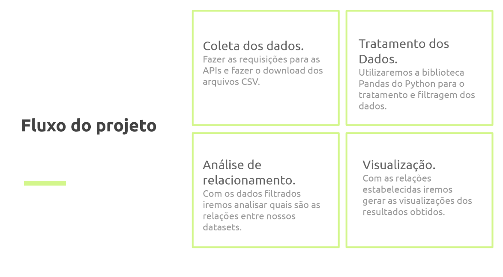

# Etapa 2 - Descrição da proposta

## Slides da Proposta

Os slides podem ser visualizados em [slides](Slides/Slides_23_06.pdf).

## Motivação e Contexto

Devido a pandemia presente no ano de 2020, achamos relevante analisar dados referentes ao novo Coronavírus a fim de relacioná-los às características socioeconômicas de diversos países. Dessa forma, podemos utilizar dados referentes à saúde, educação e índices econômicos para determinar como tais fatores refletem na resposta de cada país perante a pandemia.

## Método

A metodologia do projeto seguirá o seguinte esquema:

## Bases de Dados

| Base   |  Link  |  Descrição |
|----------|:-------------:|------:|
| Covid-19 Dataset |  https://covid19api.com/ | Dados variados sobre COVID-19 de cada país, como, por exemplo, total de casos, total de mortes, etc. |
| World Development Dataset |    https://databank.worldbank.org/source/world-development-indicators   |  Dataset tabular contendo diversas informações e indicadores sobre a economia, saúde, aspectos da população em geral, entre outras áreas.  |
| World Education Dataset | https://databank.worldbank.org/source/education-statistics-%5e-all-indicators | Dataset contém informações variadas sobre a educação de diversos países. |