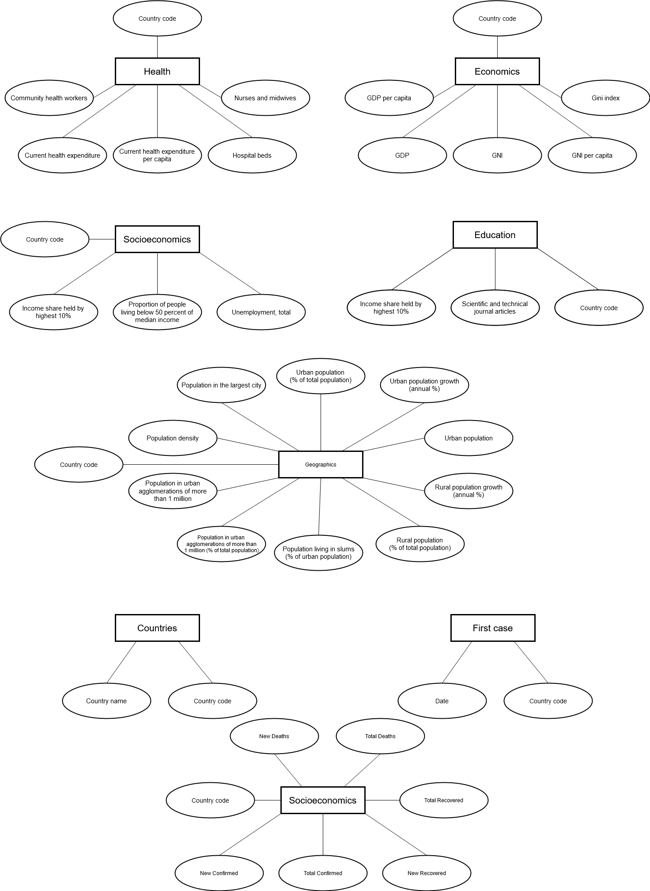

# Etapa 03 - Análises com o Primeiro Modelo Lógico

## Primeiro Modelo Conceitual

## Primeiros Modelos Lógicos

## Primeiro programa de extração e conversão de dados

> Coloque um link para o arquivo do notebook que executa a extração e conversão de dados. Ele estará dentro da pasta `notebook`. Se por alguma razão o código não for executável no Jupyter, coloque na pasta `src`. Se a extração e conversão envolverem queries executadas atraves de uma interface de um SGBD não executável no Jupyter, como o Cypher, apresente na forma de markdown.

## Primeiro conjunto de queries

O primeiro conjunto de queries está em [notebooks](notebooks/stage-3-queries.ipynb).

## Bases de Dados

| Base   |  Link  |  Descrição |
|----------|:-------------:|------:|
| Covid-19 Dataset |  https://covid19api.com/ | Dados variados sobre COVID-19 de cada país, como, por exemplo, total de casos, total de mortes, etc. |
| World Development Dataset |    https://databank.worldbank.org/source/world-development-indicators   |  Dataset tabular contendo diversas informações e indicadores sobre a economia, saúde, aspectos da população em geral, entre outras áreas.  |
| World Education Dataset | https://databank.worldbank.org/source/education-statistics-%5e-all-indicators | Dataset contém informações variadas sobre a educação de diversos países. |

## Arquivos de Dados
> Elencar os arquivos usados no projeto que estão disponíveis no Github do projeto.

nome do arquivo | link | breve descrição
----- | ----- | -----
`<nome do arquivo>` | `<link para o arquivo>` | `<breve descrição do arquivo>`

> Os arquivos devem ser colocados na pasta `data`, em subpasta conforme seu papel (externo, interim, processado, raw). A diferença entre externo e raw é que o raw é em formato não adaptado para uso. A pasta `raw` é opcional, pois pode ser substituída pelo link para a base original da seção anterior.
> Coloque arquivos relacionais (usualmente CSV), XML ou JSON que não estejam disponíveis online e sejam acessados pelo notebook.