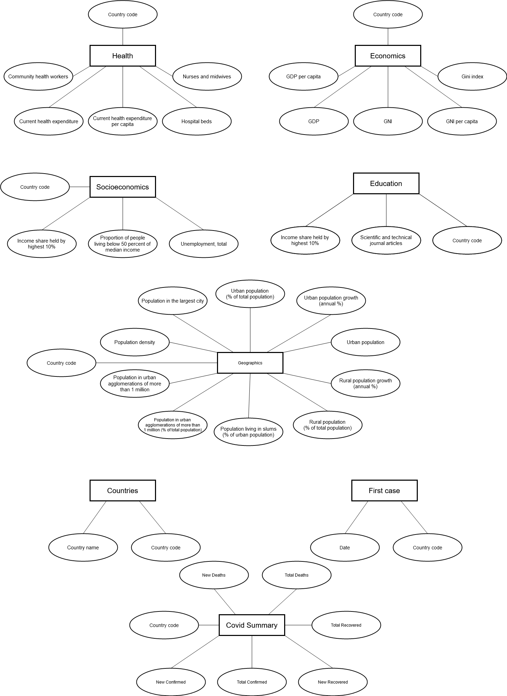
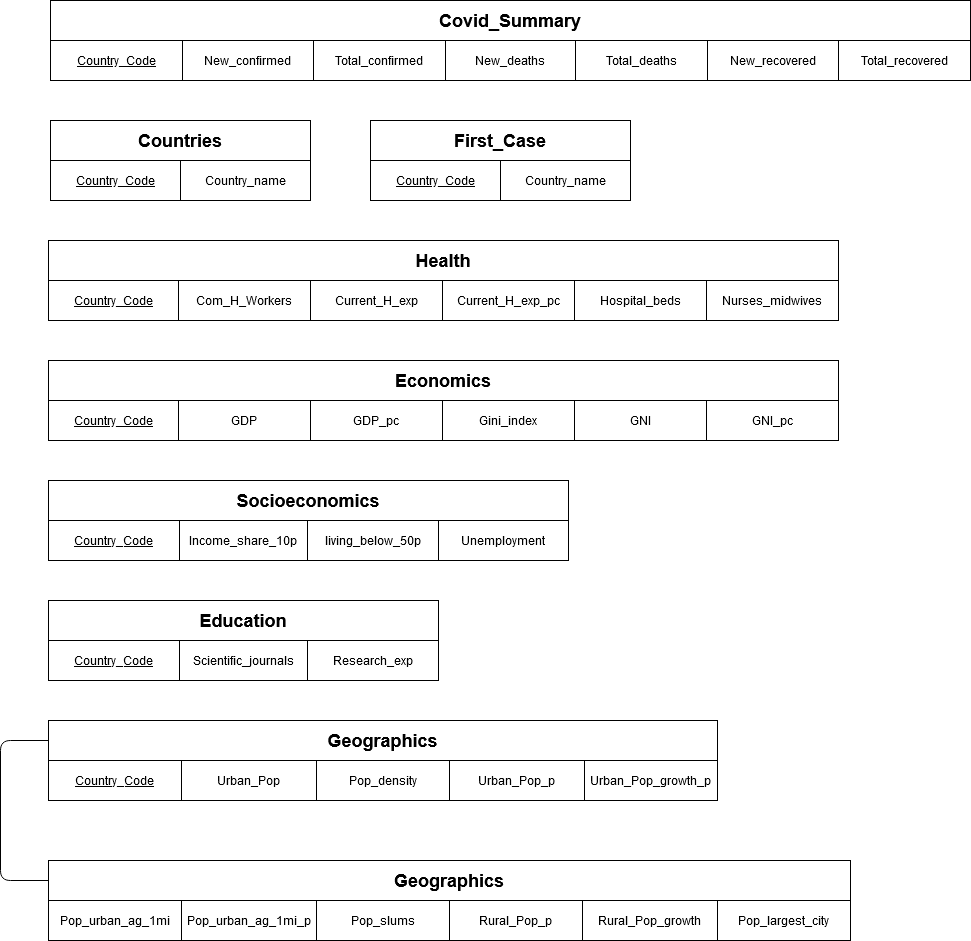

# Etapa Final

## Projeto `<Título do Projeto>`

## Equipe Poltrona de Dados
* Leonardo Livrare
* Pedro Pupo
* Pedro Strambeck

## Slides da Apresentação da Etapa Final

Os slides podem ser visualizados em [slides](slides/MC536_Final.pdf).

## Resumo do Projeto
Utilizamos diferentes bancos de dados (COVID-19 API, WorldBank) e relacionamos dados provenientes da pandemia de coronavírus em diversos países com seus respectivos dados socioeconômicos e geográficos, a fim de obter quais características de um país possuem correlação com sua resposta à pandemia.

## Motivação e Contexto

Devido a pandemia presente no ano de 2020, achamos relevante analisar dados referentes ao novo Coronavírus a fim de relacioná-los às características socioeconômicas de diversos países. Dessa forma, podemos utilizar dados referentes à saúde, educação e índices econômicos para determinar como tais fatores refletem na resposta de cada país perante a pandemia.

## Detalhamento do Projeto
> Apresente aqui detalhes da análise. Nesta seção ou na seção de Resultados podem aparecer destaques de código como indicado a seguir. Note que foi usada uma técnica de highlight de código, que envolve colocar o nome da linguagem na abertura de um trecho com `~~~`, tal como `~~~python`.
> Os destaques de código devem ser trechos pequenos de poucas linhas, que estejam diretamente ligados a alguma explicação. Não utilize trechos extensos de código. Se algum código funcionar online (tal como um Jupyter Notebook), aqui pode haver links. No caso do Jupyter, preferencialmente para o Binder abrindo diretamente o notebook em questão.

~~~python
df = pd.read_excel("/content/drive/My Drive/Colab Notebooks/dataset.xlsx");
sns.set(color_codes=True);
sns.distplot(df.Hemoglobin);
plt.show();
~~~

## Evolução do Projeto
> Relatório de evolução, descrevendo as evoluções na modelagem do projeto, dificuldades enfrentadas, mudanças de rumo, melhorias e lições aprendidas. Referências aos diagramas, modelos e recortes de mudanças são bem-vindos.
> Podem ser apresentados destaques na evolução dos modelos conceitual e lógico. O modelo inicial e intermediários (quando relevantes) e explicação de refinamentos, mudanças ou evolução do projeto que fundamentaram as decisões.
> Relatar o processo para se alcançar os resultados é tão importante quanto os resultados.

## Resultados e Discussão
> Apresente os resultados da forma mais rica possível, com gráficos e tabelas. Mesmo que o seu código rode online em um notebook, copie para esta parte a figura estática. A referência a código e links para execução online pode ser feita aqui ou na seção de detalhamento do projeto (o que for mais pertinente).
> A discussão dos resultados também pode ser feita aqui na medida em que os resultados são apresentados ou em seção independente. Aspectos importantes a serem discutidos: É possível tirar conclusões dos resultados? Quais? Há indicações de direções para estudo? São necessários trabalhos mais profundos?

## Conclusões
> Apresente aqui as conclusões finais do trabalho e as lições aprendidas.

## Modelo Conceitual Final

## Modelos Lógicos Finais

## Programa de extração e conversão de dados atualizado

> Coloque um link para o arquivo do notebook que executa a extração e conversão de dados. Ele estará dentro da pasta `notebook`. Se por alguma razão o código não for executável no Jupyter, coloque na pasta `src`. Se a extração e conversão envolverem queries executadas através de uma interface de um SGBD não executável no Jupyter, como o Cypher, apresente na forma de markdown.

## Conjunto de queries para todos os modelos

> Acrescente um link para o(s) arquivo(s) do(s) notebook(s) que executa(m) as queries para cada um dos modelos lógicos. Eles estarão dentro da pasta `notebook`. Se por alguma razão o código não for executável no Jupyter, coloque na pasta `src`. Se as queries forem executadas através de uma interface de um SGBD não executável no Jupyter, como o Cypher, apresente na forma de markdown.
> Apresente todas as suas queries em versão final, mesmo que tenham aparecido em etapas anteriores.

## Bases de Dados
| Base   |  Link  |  Descrição |
|----------|:-------------:|------:|
| Covid-19 Dataset |  https://covid19api.com/ | Dados variados sobre COVID-19 de cada país, como, por exemplo, total de casos, total de mortes, etc. |
| World Development Dataset |    https://databank.worldbank.org/source/world-development-indicators   |  Dataset tabular contendo diversas informações e indicadores sobre a economia, saúde, aspectos da população em geral, entre outras áreas.  |
| World Education Dataset | https://databank.worldbank.org/source/education-statistics-%5e-all-indicators | Dataset contém informações variadas sobre a educação de diversos países. |

## Arquivos de Dados
nome do arquivo | link | breve descrição
----- | ----- | -----
`countries.csv` | [link](data/countries.csv) | `Lista de países e seus códigos`
`fist_case.csv` | [link](data/first_case.csv) | `Lista de países e seus primeiros casos de covid`
`summary.csv` | [link](data/summary.csv) | `Lista de países e dados gerais sonbre a covid`
`world_development_indicators.csv` | [link](data/world_development_indicators.csv) | `Lista de países e diversos indicatores agrupados nas tabelas do modelo lógico`